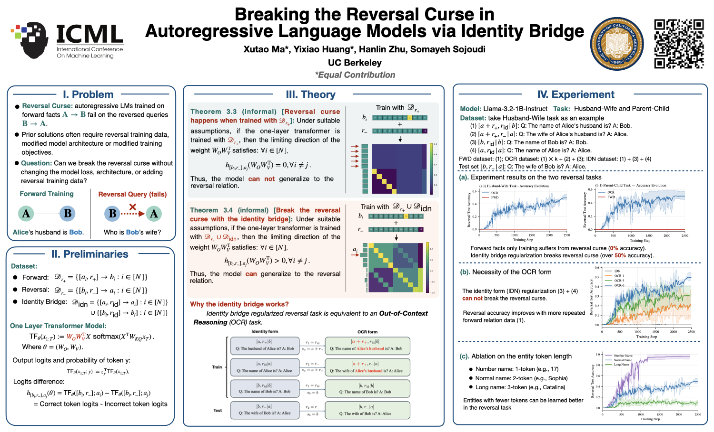

# Breaking the Reversal Curse in Autoregressive Language Models via Identity Bridge

Code and data to reproduce the **real-LLM fine-tuning experiments** from our paper:

> **Breaking the Reversal Curse in Autoregressive Language Models via Identity Bridge**
> Xutao Ma\*, Yixiao Huang\*, Hanlin Zhu, Somayeh Sojoudi — UC Berkeley (\*equal contribution), ICML 2026, Spotlight.
> [Paper](https://arxiv.org/abs/2602.02470)

[](poster-reversal-curse.pdf)

## The reversal curse

An autoregressive LM trained only on a forward fact — "**A**'s husband is **B**" — typically
fails the reverse question "who is **B**'s wife?". This is the **reversal curse**, widely
believed to be a fundamental limitation of causal LMs. Our paper shows it can be broken
*without* training on reverse facts and *without* changing the architecture or loss, simply by
adding an **identity bridge**: regularizer facts of the form "**A** → **A**" that carry no new
relational information but reshape the optimization landscape.

The key empirical finding is that the bridge only works in its **out-of-context reasoning(OCR) form** — phrasing the
self-identity of **A** as a *composition*, "the wife of **A**'s husband is **A**" — and **not**
in the naive **identity (IDN) form**, "the name of **A** is **A**". With the OCR-form bridge and
the forward fact up-weighted 6×, a fine-tuned `Llama-3.2-1B-Instruct` reaches **~50%** reverse-
question accuracy, versus **~0%** for forward-only training. The IDN form stays cursed.

The fine-tuning uses full-parameter SFT via a lightly modified
[LLaMA-Factory](https://github.com/hiyouga/LLaMA-Factory) (bundled under
[`LLaMA-Factory/`](LLaMA-Factory)), to which we added per-sample loss weighting for the 6× up-weighting, which is equal to repeat it for 6 times in the dataset.

## Repository layout

```
reversal_curse_code/
├── README.md                              # this file
├── requirements-lock.txt                  # pinned environment (full pip freeze; see Setup)
├── env_var.sh                             # optional env overrides (model path, NGPUS, W&B, ...)
├── paper.pdf                              # the paper
├── poster-reversal-curse.pdf              # ICML 2026 spotlight poster (vector)
├── poster-reversal-curse.png              # poster preview shown in this README
├── scripts/                               # one launcher per experiment group (see "Running")
│   ├── train_husband_wife.sh              # Husband–Wife task: FWD baseline + IDN-form + OCR-form bridge
│   ├── train_parent_child.sh              # Parent–Child task: the same three conditions
│   └── train_name_len.sh                  # Husband–Wife token-length ablation (number / normal / long names)
└── LLaMA-Factory/                         # bundled, trimmed trainer with per-sample weighting added
    ├── WEIGHTED_TRAINING.md               # how the per-sample weighting works (+ multi-GPU notes)
    ├── LICENSE                            # upstream LLaMA-Factory license (Apache-2.0)
    ├── bash/
    │   └── train_people-description.sh    # shared SFT launcher invoked by all three scripts
    ├── examples/deepspeed/
    │   └── ds_z2_config.json              # DeepSpeed ZeRO-2 config used by the launcher
    ├── src/llamafactory/train/sft/
    │   └── trainer.py                     # our per-sample weighting (compute_loss + batch-mean weight)
    └── data/
        ├── dataset_info.json              # registers the 19 datasets (maps key → file)
        ├── wife_husband/                  # Husband–Wife task     — couple_* datasets (5 files)
        ├── child_parent/                  # Parent–Child task     — parent_* datasets (5 files)
        └── name_len/                      # token-length ablation — names_*  datasets (9 files)
```

## The data recipe

Each task pairs `100` **A**↔**B** entities (real first names; the Husband–Wife couple
*(Catherine, Emiliano)* is used below). The headline method is the **OCR-form identity bridge**.
All examples are in Alpaca format (`instruction` → `output`), one fact per example, with a
per-example `weight`:

| Split (dataset) | Example: `instruction → output` | weight | Role |
|---|---|:--:|---|
| **train** `couple_train_bridge` | `The name of Catherine's husband is? → Emiliano` | **6** | forward fact, up-weighted `k=6` |
| **train** `couple_train_bridge` | `The wife of Catherine's husband is? → Catherine` | 1 | **identity bridge, OCR form** (wife∘husband = id) |
| **train** `couple_train_bridge` | `The name of Emiliano is? → Emiliano` | 1 | self-identity of **B** |
| **eval** `couple_eval` | `The wife of Emiliano is? → Catherine` | — | reverse fact (never trained → **reversal test**) |
| **shortcut** `couple_shortcut` | `The wife of Emiliano is? → Emiliano` | — | degenerate "echo the queried name" trap |

The two comparison conditions in the same task:

- **`couple_train_forward`** (FWD baseline): the plain forward fact only, all weights `= 1`
  — `The husband of Catherine is? → Emiliano`. Reversal accuracy stays ~0.
- **`couple_train_bridge_idn`** (IDN-form bridge, the ablation that *fails*): forward fact
  up-weighted 6× + naive self-identities `The name of Catherine is? → Catherine` and
  `The name of Emiliano is? → Emiliano`. Stays cursed.

**Sizes:** every `*_train_bridge` / `*_train_bridge_idn` file has `300` examples (100 pairs × 3
facts); every `*_train_forward` file has `100`; every `eval` / `shortcut` file has `100`.

Accuracy on the **eval** set measures whether the reversal curse is broken; accuracy on the
**shortcut** set should stay low.

## The datasets

All 19 files are registered in
[`LLaMA-Factory/data/dataset_info.json`](LLaMA-Factory/data/dataset_info.json). The registry key
is what the training scripts pass via `--dataset` / `--eval_dataset`.

| Task / dir | Registry keys → files |
|---|---|
| **Husband–Wife** `wife_husband/` | `couple_train_forward`, `couple_train_bridge` (OCR form), `couple_train_bridge_idn` (IDN form), `couple_eval`, `couple_shortcut` |
| **Parent–Child** `child_parent/` | `parent_train_forward`, `parent_train_bridge`, `parent_train_bridge_idn`, `parent_eval`, `parent_shortcut` |
| **Token-length ablation** `name_len/` | `names_{num,normal,long}_train` + matching `_eval` / `_shortcut` (one-token numbers, two-token "normal", three-token "long" names) |

## Setup

The exact environment we ran is pinned in [`requirements-lock.txt`](requirements-lock.txt) (a full
`pip freeze`; key versions: `torch==2.9.0`, `transformers==4.57.6`, `deepspeed==0.18.3`, CUDA 12.8,
Python 3.10).

```bash
# 1. Create the environment (Python 3.10).
conda create -n identity-bridge python=3.10 -y
conda activate identity-bridge
conda install -c nvidia cuda-toolkit=12.8 -y

# 2. Install the pinned dependencies, then the bundled trainer.
pip install -r requirements-lock.txt
pip install -e ./LLaMA-Factory --no-deps
```

`--no-deps` is intentional: `requirements-lock.txt` already pins every dependency, so the bundled
[`LLaMA-Factory/`](LLaMA-Factory) package is installed without re-resolving (and possibly
upgrading) them. If the lock file does not fit your platform (e.g. a different CUDA version), drop
it and do a looser `pip install -e ./LLaMA-Factory` instead, which resolves from its own
[`requirements.txt`](LLaMA-Factory/requirements.txt) — trading exact reproducibility for portability.

**Base model.** The scripts default to the gated HF id `meta-llama/Llama-3.2-1B-Instruct` (run
`huggingface-cli login` and accept the Llama license), or set
`MODEL_NAME_OR_PATH=/path/to/Llama-3.2-1B-Instruct` to point at a local copy (see below).

## Running the experiments

All configuration is read from environment variables (with sensible defaults), so the usual
invocation just sets the GPU count and the model path:

```bash
conda activate identity-bridge

NGPUS=1 MODEL_NAME_OR_PATH=/path/to/Llama-3.2-1B-Instruct bash scripts/train_husband_wife.sh
NGPUS=1 MODEL_NAME_OR_PATH=/path/to/Llama-3.2-1B-Instruct bash scripts/train_parent_child.sh
NGPUS=1 MODEL_NAME_OR_PATH=/path/to/Llama-3.2-1B-Instruct bash scripts/train_name_len.sh
```

Each script reproduces one group of experiments from the paper:

- **`scripts/train_husband_wife.sh`** — the main Husband–Wife reversal task (Sec. 4.2, Fig. 6a)
  plus the bridge-format ablation (Sec. 4.2.1, Fig. 7). It fine-tunes the model under all three
  training sets in turn: the forward-only **FWD baseline** (stays cursed), the naive **IDN-form**
  identity bridge (ablation, also stays cursed), and the proposed **OCR-form** identity bridge,
  which breaks the reversal curse.
- **`scripts/train_parent_child.sh`** — the same three conditions on the Parent–Child task
  (Sec. 4.2, Fig. 6b), showing the result transfers to a second relation.
- **`scripts/train_name_len.sh`** — the entity token-length ablation on the Husband–Wife task
  (Sec. 4.2.2, Fig. 8). It runs the OCR-form recipe with one-token "number" names, two-token
  "normal" names, and three-token "long" names, probing how entity name length affects reverse
  generalization.

Each run writes a checkpoint, `train.log`, and eval metrics (reversal- and shortcut-test accuracy)
to `saved_models/<label>-.../`.

## Per-sample weighting (the up-weighting mechanism)

We added a `weight` column to LLaMA-Factory's SFT path so each training example carries a
scalar importance (the forward fact uses `6`, the bridge/self-identity facts use `1`). The
trainer scales each example's (token-normalized) loss by `w_i / mean_w`, where `mean_w` is the
mean weight over the **global effective batch**
(`world_size × gradient_accumulation_steps × per_device_train_batch_size` samples). The scale
factors average to 1 over each batch, so the overall gradient scale is preserved while example
*i* contributes in proportion to `w_i`. With all weights `= 1` this is an exact no-op and
training matches stock LLaMA-Factory.

## Acknowledgements

The trainer under `LLaMA-Factory/` is a trimmed, lightly modified copy of
[LLaMA-Factory](https://github.com/hiyouga/LLaMA-Factory) (Apache-2.0); its license is retained
at [`LLaMA-Factory/LICENSE`](LLaMA-Factory/LICENSE). Our modifications add per-sample loss
weighting to the SFT data pipeline and trainer; unrelated datasets, run artifacts, and the
benchmark-eval harness were removed.

If you find this code useful, please cite our paper:

```bibtex
@article{ma2026reversal,
  title   = {Breaking the Reversal Curse in Autoregressive Language Models via Identity Bridge},
  author  = {Ma, Xutao and Huang, Yixiao and Zhu, Hanlin and Sojoudi, Somayeh},
  journal = {arXiv preprint arXiv:2602.02470},
  year    = {2026}
}
```
